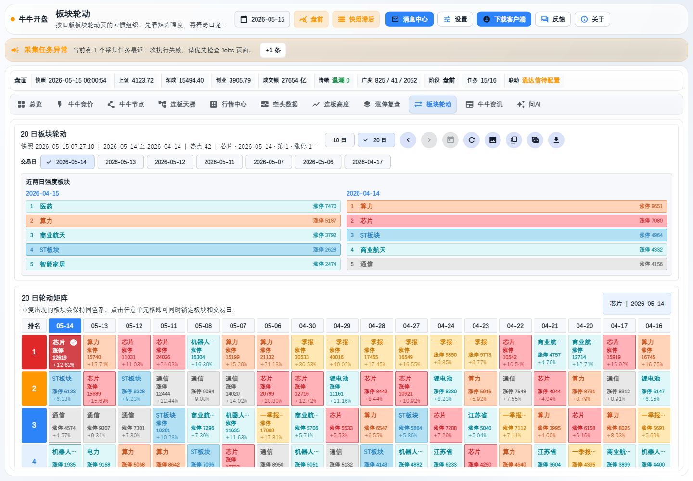

# niuniu_flutter_desktop

Flutter desktop and web client for the NiuNiu market workstation.



## What Is Included

- Multi-platform Flutter client source for desktop and web builds.
- Market workstation pages, including overview, limit review, and plate rotation.
- Tests for the main UI flows and page behavior.
- Helper scripts for local build and release workflows.

## Configuration

The client does not commit a production API host, download host, private
certificate, or key. Provide environment-specific values at build or run time.

- `NIUNIU_API_BASE_URL`: API endpoint used by the client.
- `NIUNIU_CLIENT_DOWNLOAD_URL`: optional desktop client download link.
- `-ApiBaseUrl`: helper script override for the API endpoint.
- `-ClientDownloadUrl`: helper script override for the download link.

Private certificates, local runtime logs, `.env` files, and build artifacts are
ignored by git.

## Development

```powershell
flutter pub get
flutter analyze
flutter test
```

For web builds, pass endpoint values through environment variables or script
parameters instead of committing them to source control.
